## Hello!Nice to see you.

  

    

- :cloud: I'm Cloud engineer and Backend developer in Japan.
- :trophy: I have passed all AWS cetification exams.
- :computer: I enjoy competitive programming at [AtCoder](https://atcoder.jp/?lang=ja).
- :notebook_with_decorative_cover: I have recently been publishing mainly on the following corporate blogs.
- My main output: [DevelopersIO](https://dev.classmethod.jp/author/bun913/)

<!--START_SECTION:lapras-card-->

<!--END_SECTION:lapras-card-->

## My Activity

## Presentation

Pleae look at [Presentation](presentation/presentation.md).

## Certification

### :cloud: Cloud

|Certification                              |Acquisition date         |
|----------------------------------------------------|------|
|AWS Certified Cloud Practitioner                    |2021/2|
|AWS Certified Solutions Architect – Associate       |2021/2|
|AWS Certified SysOps Administrator - Associate      |2021/3|
|AWS Certified Developer - Associate                 |2021/4|
|AWS Certified Solutions Architect - Professional    |2021/5|
|AWS Certified DevOps Engineer - Professional        |2021/5|
|AWS Certified Security - Specialty                  |2021/6|
|AWS Certified Database - Specialty                  |2021/7|
|AWS Certified Advanced Networking - Specialty       |2021/8|
|AWS Certified Data Analytics - Specialty            |2021/9|
|AWS Certified Machine Learning - Specialty          |2021/10|
|AWS Certified: SAP on AWS - Specialty               |2022/8|

### :package: Container & OS

|Certification                              |Acquisition date         |
|-------------------------------------------------------|-------------|
|LPIC Level1                                            |2020/5|
|LPIC Level 2                                           |2020/8|
|LPIC Level 3(304)                                      |2020/9|
|Certified Kubernetes Administrator (CKA)               |2021/8|
|Certified Kubernetes Application Developer (CKAD)      |2021/8|

### :book: English

|Certification                              |Acquisition date         |
|-------------------------------------------------------|-------------|
|TOEIC 605 scored                                            |2022/2|
|TOEIC 675 scored                                            |2022/7|
